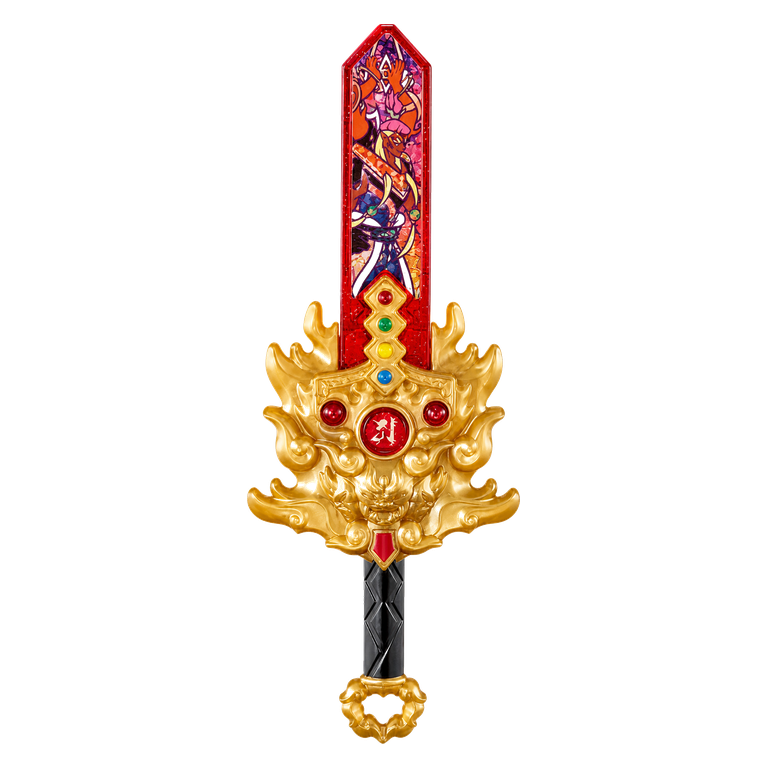
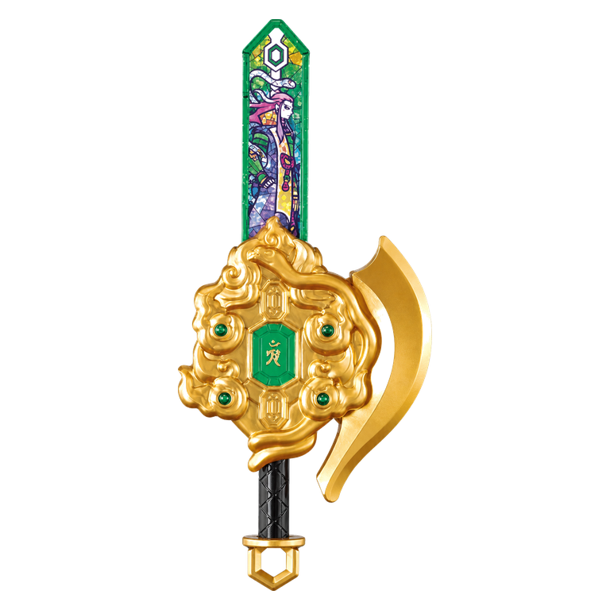
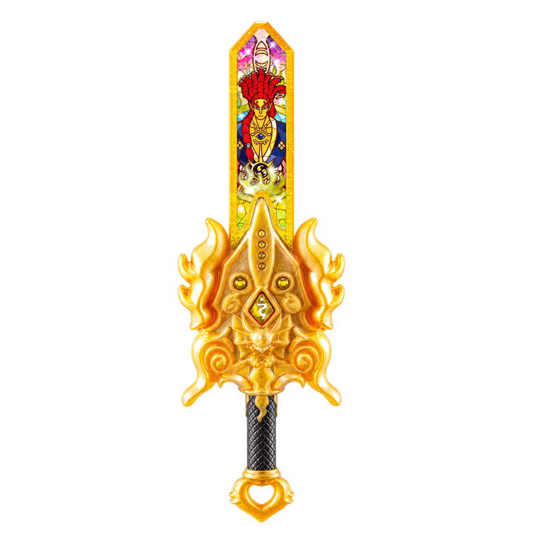

# YWAPI

**YWAPI** is a community-maintained, read-only API for Yo-kai Watch NFC collectibles.

It is built in the spirit of AmiiboAPI: simple static JSON, stable image URLs, no authentication, and easy app-side matching after a scan.

<p align="center">
  
  
  
</p>

<p align="center">
  <a href="api/ark/index.json"></a>
  <a href="api/status/index.json"></a>
  <a href="docs/API.md"></a>
  <a href="docs/CONTRIBUTING.md"></a>
</p>

## Base URL

```text
https://raw.githubusercontent.com/NFCSPOOFER/YWAPI/main
```

## Quick Start

Fetch all Yo-kai Arks:

```text
GET /api/ark/index.json
```

Direct URL:

```text
https://raw.githubusercontent.com/NFCSPOOFER/YWAPI/main/api/ark/index.json
```

Lookup by decoded NFC identity:

```text
GET /api/ark/by-display-code/0103MBW.json
GET /api/ark/by-ark-key/MBW.json
GET /api/ark/by-numeric-id/28940.json
```

Lookup by catalog ID:

```text
GET /api/ark/by-id/YW-ARK-0338.json
GET /api/ark/by-number/0338.json
```

## App Matching

When an app scans and decodes a Yo-kai Ark, match in this order:

1. `displayCode`
2. `arkKey`
3. `numericId`
4. manual fallback

UIDs are not public item identities. Duplicate physical tags for the same Ark have different UIDs, while the decoded Ark identity stays the same.

## JavaScript Example

```js
const baseUrl = "https://raw.githubusercontent.com/NFCSPOOFER/YWAPI/main";
const displayCode = "0103MBW";

const response = await fetch(`${baseUrl}/api/ark/by-display-code/${displayCode}.json`);
const { ark } = await response.json();

console.log(ark.name);
console.log(ark.image);
```

## Current Dataset

| Section | Status | Count |
| --- | --- | ---: |
| Yo-kai Arks | Available | 341 |
| Dream Medals | Planned | 0 |
| Treasure Medals / T Medals | Planned | 0 |
| Yo-seiken | Planned | 0 |
| Yo-kai Y Medals | Planned | 0 |
| Genju Disks | Planned | 0 |

## Endpoint Map

| Purpose | Endpoint |
| --- | --- |
| API summary | `/api/index.json` |
| All Arks | `/api/ark/index.json` |
| Ark CSV export | `/api/ark/ark.csv` |
| By YWAPI ID | `/api/ark/by-id/YW-ARK-0338.json` |
| By legacy project ID | `/api/ark/by-legacy-id/YKW-ARK-0338.json` |
| By catalog number | `/api/ark/by-number/0338.json` |
| By display code | `/api/ark/by-display-code/0103MBW.json` |
| By Ark key | `/api/ark/by-ark-key/MBW.json` |
| By numeric ID | `/api/ark/by-numeric-id/28940.json` |
| By series | `/api/ark/by-series/sacred-armory.json` |
| By status | `/api/ark/by-status/confirmed.json` |
| Supported types | `/api/type/index.json` |
| Known series | `/api/series/index.json` |
| Status counts | `/api/status/index.json` |
| Last updated | `/api/lastupdated/index.json` |

## Object Example

```json
{
  "id": "YW-ARK-0338",
  "legacyId": "YKW-ARK-0338",
  "name": "Wildfire Blaze",
  "series": "Sacred Armory",
  "seriesGroup": "Exclusive/Promotional Keystones",
  "rarity": null,
  "type": "Ark",
  "catalogNumber": 338,
  "sourceNumber": 6,
  "displayCode": "0103MBW",
  "displayCodes": ["0103MBW"],
  "arkKey": "MBW",
  "arkKeys": ["MBW"],
  "numericId": 28940,
  "numericIds": [28940],
  "image": "https://raw.githubusercontent.com/NFCSPOOFER/YWAPI/main/images/ark/front/YW-ARK-0338.png",
  "imageBack": "https://raw.githubusercontent.com/NFCSPOOFER/YWAPI/main/images/ark/back/YW-ARK-0338.png",
  "status": "confirmed",
  "scanCount": 2,
  "uniqueTagCount": 2
}
```

## Status Values

| Status | Meaning |
| --- | --- |
| `confirmed` | Multiple community scans support the identity. |
| `single_scan` | One successful community scan supports the identity. |
| `missing` | No successful decoded scan yet. |
| `conflict` | Multiple decoded identities currently exist for the catalog entry. |

## Docs

- [API documentation](docs/API.md)
- [Contribution guide](docs/CONTRIBUTING.md)
- [Roadmap](docs/ROADMAP.md)
- [Terms](docs/TERMS.md)

## Disclaimer

YWAPI is an unofficial community preservation project and is not affiliated with Bandai, Level-5, Nintendo, or any other rights holder.
